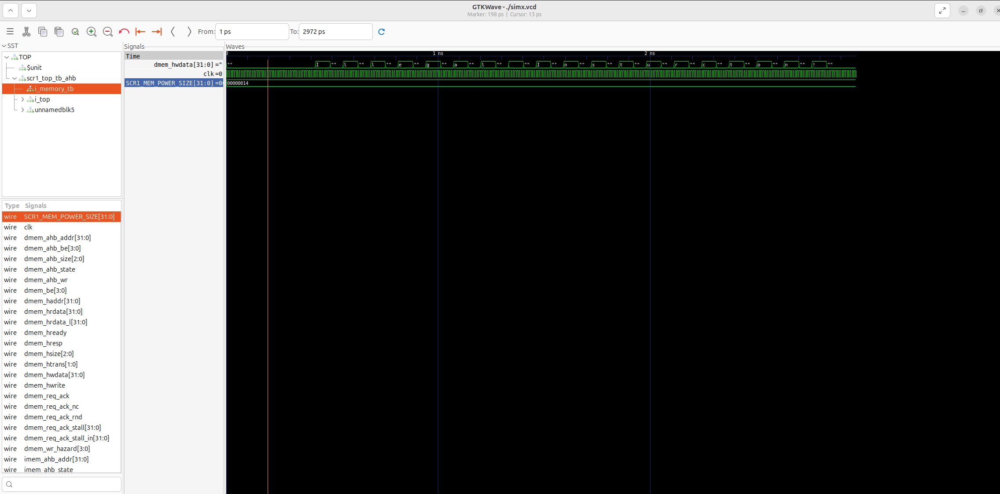

# LAB_2

В ходе лабораторной работы изучено и модифицировано открытое ядро SCR1 с архитектурой RISC-V.

В соответствии с вариантом задания проделана следующая работа:

1. С исходным кодом собрана симуляционная модель с одним тестом (illegal.S) с помощью команды:

    >make TARGETS=riscv_isa

     По сообщению из log подтверждена работоспособность модели ("Test passed").

2. В файле ./src/includes/scr1_arch_description.svh параметрам ядра Reset Vector и Trap Vector установлены адреса 0xF00 и 0xB00 соответственно.

3. Изменён linker-скрипт ./sim/tests/common/link.ld для корректного запуска теста с новыми значениями Reset Vector и Trap Vector.

4. Модифицирована обработка исключений trap_vector в файле ./sim/tests/common/riscv_macros.h. Обрабатывается исключение Breakpoint. В log должно выводиться сообщение "Breakpoint is Detect!".

5. Собрана симуляционная модель с модифицированным кодом, проведена симуляция.

6. Собрана симуляционная модель с векторным файлом simx.vcd. Его можно запустить через gtkwave. Результат располагается на рисунке ниже.

